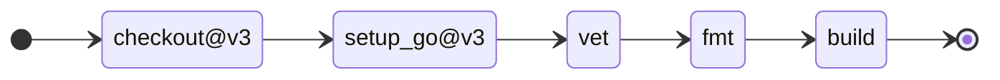
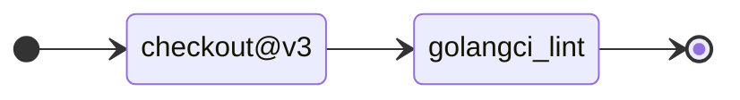
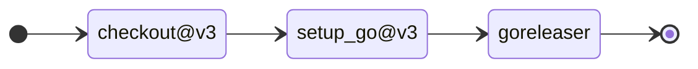

# district-21

District 21 Game

## Testing

> go test ./... -v

If we want test with coverage

> go test ./... -test.coverprofile coverage
> go test ./... -cover

## CI/CD

CI Tool Chain For Go

For my personal code I use GitHub as a repository, so assuming that the tools
I’ll employ are:

- GitHub Actions: Automate the workflow
- Codecov.io: A coverage dashboard
- Readme badges: Easy visibility dashboard on CI status

- Templates CI/CD for golang projects
  
### CI-WORKFLOW [ ./gihub/workspaces/ci-go.yml ]

### TO DOs

- https://github.com/tj-actions/coverage-badge-go/tree/main/.github/workflows
- https://medium.com/synechron/how-to-set-up-a-test-coverage-threshold-in-go-and-github-167f69b940dc

Start with any events on

- Push:
  - On branches `main` or `feature`
- Any pull_request

### LINT Golang [ ./github/workspaces/golangci-lint]

Start with

- Push:
  - On Tag with name as `v*`
  - On branches `main` or `feature`
- Any pull_request

### CD Workflow [ ./github/workspaces/release.yml ]

- Push:
  - On Tag with name as `v*`
  - On only branches `main`
- Any pull_request

## Colaborate

**Include Fix**
fix(#issueId): `include a comment`

**Include Feature**
feat(#issueId): `Include an commit change`

**Improbe documentation**
doc(#issueid): `Include an change`

For example
    doc(#1): [README.md] Include CI and CD Workflows
